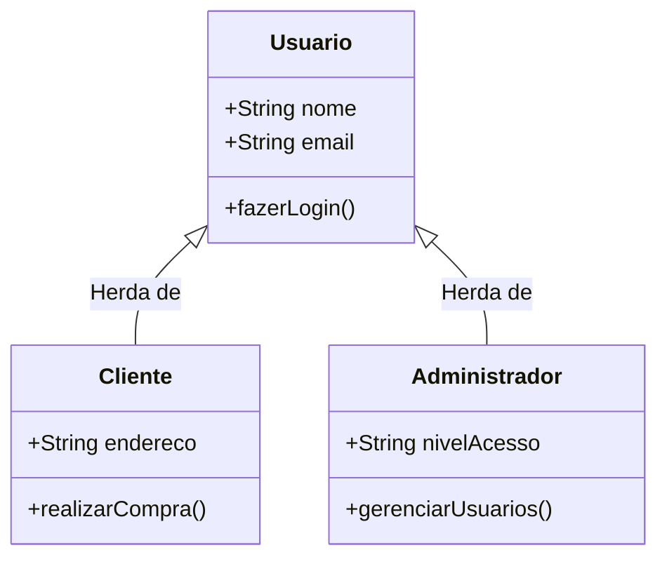
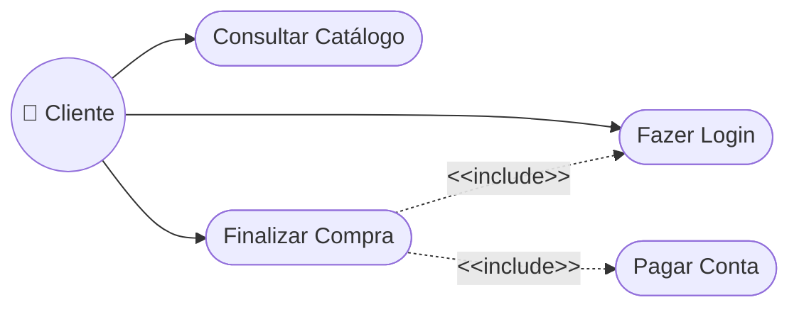

# Documento de Projeto de Software

## Histórico de alterações

| Data | Versão | Descrição | Autor (github) |
| :----: | :------: | :---------: | :-----: |
| 22/07/2026 | 0.0 | Criação do documento de requisitos | Pedro Henrique (CodePhsp) |

## Introdução

### Propósito do documento de requisitos

Esse documento tem o objetivo de detalhar os requisitos dos usuários que deverão ser atendidos
pelo sistema a ser construído nesse projeto.

### Público alvo

Este documento destina-se aos arquitetos de software, engenheiros de software
testadores e os stekeholders do negócio.

## Descrição geral do produto

### Situação atual

Atualmente o cliente gerencia os requerimentos de parcelamento em uma planilha.

### Escopo

| Nº | Modulo | Descrição |
| :----: | :------: | :---------: |
| 1 | Aplicativo | Será desenvolvido um aplicativo web |

### Autores

| Nº | Autor | Responsabilidade |
| :-: | :------: | :---------: |
| 1 | Administrador | Aprovar parcelamentos, emitir relatórios |
| 2 | Cliente | Solicitar parcelamentos, consultar parcelas e realizar pagamentos |

## Requisitos

### Requisitos funcionais (RF)

| ID | Descrição |
| :-: | :------ |
| RF 01 | O sistema deve permitir que um cliente solicite um parcelamento. |
| RF 02 | O sistema deve permitir que um cliente liste as parcelas. |
| RF 03 | O sistema deve permitir que um cliente efetue o pagamento da parcela em aberto. |
| RF 04 | O sistema deve permitir que um administrador aprove um parcelamento. |
| RF 05 | O sistema deve permitir que um administrador liste parcelas. |

### Requisitos não-funcionais (RNF)

| ID | Descrição | Categoria |
| :-: | :------ | :-------: |
| RNF 01 | Somente usuários autenticados podem acessar o aplicativo web | Seguraça |
| RNF 02 | O sistema deve ser desenvolvido utilizando python e FastAPI | Tecnologia |
| RNF 03 | XXXXXXXX | Usabilidade/Segurança/Software/Hardware |

### Regras de negócio

| ID | Descrição |
| :-: | :------ |
| RN 01 | Um parcelamento somente poderá ser aprovado por um administrador. |
| RN 02 | Um cliente poderá ter um ou mais de um parcelamento em aberto. |

### Identificação dos casos de uso

> [!TIP]
> A definir

#### Diagrama de classes

Vide arquivo [link para o arquivo]

#### Diagrama de casos de uso

Vide arquivo [link para o arquivo]
